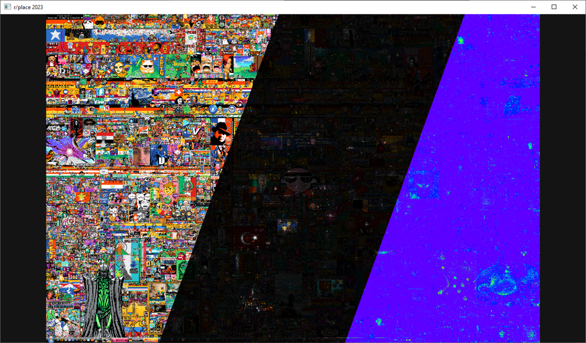

# r/place 2023 visualization

  

The r/place Timeline Viewer is the final project for our visualization course. It provides a dynamic and interactive way to explore the evolution of Reddit's r/place 2023 canvas over time. The project allows users to gain insights into how different areas of the canvas were pixelated and how user activity changed over the course of the event.

## Key Features
* **Time-based Visualization**: Users can navigate through 5 minute time frames to see how the canvas transformed over hours and days. The time frames can also be replayed like a video.
* **Brightness Heatmap**: A heatmap view showcases the intensity of activity in different canvas regions, highlighting the most actively pixelated areas brighter and less active areas darker.
* **Thermal Map**: A second view focusing on only showing the activity in different areas with thermal colors.
* **Zooming**: Users can zoom in to explore the canvas at a pixel-level detail, observing the intricate patterns and designs created by the Reddit community.

## How To Use
* Use the `timeline slider` to choose a specific time frame you want to explore.
* Use tbe `arrow keys` to move single frames forwards / backwards.
* Press `space` to play the timeline as a video.
* Switch to the brightness map or thermal map view using the `radio buttons`.
* Zoom in with the `mouse wheel` and drag with `left mouse button` to look at specific areas.

## Download
* Download the image data we generated as .zip files from the following links:  
  * [default timeline](https://1drv.ms/u/s!AluoC5z79cd581j7x6LpDcWuLjcC?e=UqR4WK)
  * [brightness scaled view](https://1drv.ms/u/s!AluoC5z79cd581oAC6A69pcxv87X?e=P0agdJ)
  * [thermal view](https://1drv.ms/u/s!AluoC5z79cd581l4gOyNemB67pdb?e=RGG76e)
* Extract the zipped images into different directories. 
* Replace the paths of the 3 directories in the `imgDataDirs` vector in `~/source/pixel_canvas.cpp` with your paths

<!-- ## Prerequisites -->
<!-- In order to build the applications, a C++ compiler is required. If you have not programmed using C++ before, then you may need to install a compiler. We will also use the [CMake](https://cmake.org/download/) build tool. Operating system specific instructions are below. -->

## Building and Running the Application

### Windows

There are two suggested methods for building and running the application in Windows: using either Visual Studio or Visual Studio Code. 

Method 1: Visual Studio
 * If not already installed, install [CMake](https://cmake.org/download/) and [Microsoft Visual Studio](https://visualstudio.microsoft.com/downloads/). The Community version of VS can be downloaded for free. When the installer prompts you to choose ‘Workloads’, choose `Desktop development with C++`.
 * Open CMake GUI
 * In the first input field, labeled ‘where is the source code’, browse to the root directory of the framework (the directory should contain the file CMakeLists.txt, e.g. `C:\Users\name\Documents\PixelCanvas`)
 * In the second input field, labeled ‘where to build the binaries’, copy the input from the first field and add ‘\build’ to the end of the path (e.g. `C:\Users\name\Documents\PixelCanvas\build`)
 * Click ‘Configure’
 * If prompted, click ‘Yes’ to confirm that a new build directory should be created
 * Specify your Visual Studio version, and click ‘Finish’
 * Click ‘Generate’
 * Click ‘Open Project’ to open the project in Visual Studio. Alternatively, one can open the ‘.sln’ file generated inside the build folder
 * In the Solution Explorer window in Visual Studio, confirm that the `pixel_canvas` target is shown in bold. This means that it is set as the start-up project. If not, right-click on `pixel_canvas` and select ‘Set as Startup Project’
 * Run the application by clicking the run symbol (green triangle in the toolbar).

 Method 2: Visual Studio Code
 * Install [Visual Studio Code](https://code.visualstudio.com/). From the extensions window (View > Extensions), install the `CMake Tools` and `C/C++` extensions.
 * Open the ExSciVis202X folder (File > Open Folder...)
 * The toolbar at the bottom should show a button saying that CMake is ready.
 * If a button with `no kit selected` is shown, click on it and select a kit. 
 * Make sure the default build target is set to `[pixel_canvas]` instead of `[ALL_BUILD]`
 * Launch the build by clicking on the triangle in the toolbar. 

### Linux

Prerequisites:
 * install [CMake](https://cmake.org/download/) from either the linked page, from Ubuntu Software, or install using a package manager such as apt or snappy
 * if you have not developed using c++ before, install the build-essentials package, which contains g++, a C++ compiler. In the terminal, enter:

`$ sudo apt install build-essential`

Building and Running:
 * Open a terminal inside the root directory of the assignment framework, ExSciVis202X
 * Create a build directory, in which the applications will be built, and navigate into the directory: 

`$ mkdir build` 

`$ cd build`

 * Run CMake (note the two dots, to tell CMake that the build script is in the parent directory):

`$ ccmake .. `

 * Press ‘C’ to configure CMake (you need to do this twice when the framework is built for the first time).
 * Press ‘G’ to generate the makefiles. After this, the terminal interface of CMake will disappear.
 * Build the applications by entering:

`$ make`

 * To be able to run the applications, we need to navigate to the directory where the binaries are located:

`$ cd build/Release`

 * Start the applications by entering `./<name_of_application>`, for example:

`$ ./pixel_canvas`

### MacOS

Prerequisites:
 * The built in compiler should be sufficient.
 * Install [CMake](https://cmake.org/download/). To enable calling CMake from within a terminal window, enter:

`$ PATH="/Applications/CMake.app/Contents/bin":"$PATH"`

Building and running steps are the same as on Linux.

GUI created with ImGui
https://github.com/ocornut/imgui
